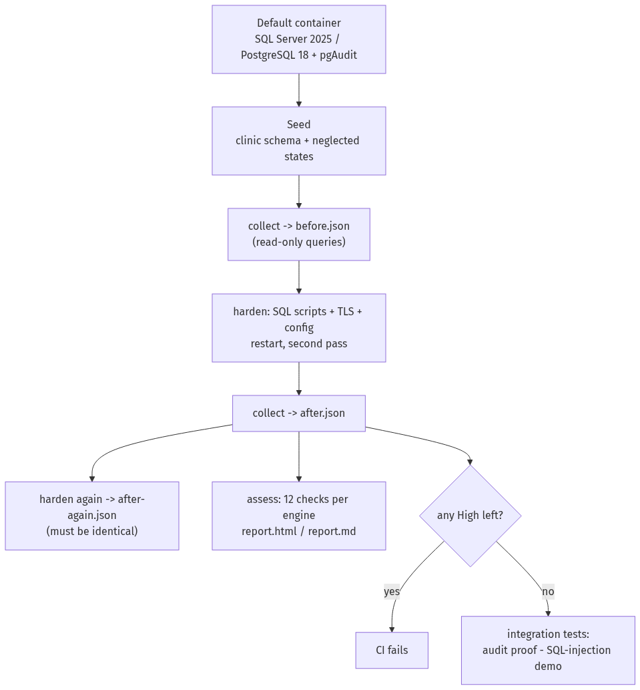

# Lab 08 — SQL Server and PostgreSQL hardening and audit

Assess a default SQL Server and a default PostgreSQL with 12 checks each, harden both with idempotent scripts, prove
that the audit trail records the events that matter, and show unsafe dynamic SQL next to its parameterized fix. The
same code assesses the server before and after hardening, so the comparison is exact.

**Status: completed.** Every result in this repository comes from GitHub Actions runs against containers
(SQL Server 2025 Developer on Linux, PostgreSQL 18.6 with pgAudit) loaded with synthetic data. It has never been run
on a production server.

## How it works



1. Start a default container and load a small fictional "clinic" schema. A few common neglected-server states are
   seeded on purpose (an over-privileged app login, TRUSTWORTHY on, a plaintext national-ID column…); everything else
   in the "before" state is the container default. [`docs/checks.md`](docs/checks.md) says which is which.
2. **Collect** a read-only snapshot (`SELECT`/`SHOW` only, enforced by a test) into JSON.
3. **Assess** it: 12 pure checks per engine turn the snapshot into findings. A check whose data could not be collected
   reports *Not evaluated*; it never passes silently.
4. **Harden** with numbered, idempotent scripts plus the container-level steps (TLS certificate, config files,
   restart). Hardening runs once before and once after the restart, then a third time to prove it changes nothing.
5. Collect again, compare, and fail CI if any High finding (or any High check that could not be evaluated) remains.
6. Integration tests prove the audit trail and the SQL-injection demo against the hardened servers.

## Quick start (Linux, macOS or WSL with Docker)

```bash
python -m venv .venv && . .venv/bin/activate
pip install -r requirements.txt && pip install --no-deps -e .
scripts/ci-secrets.sh .env.lab && set -a && . ./.env.lab && set +a   # throwaway passwords
scripts/make-certs.sh certs                                         # throwaway lab CA + server certificate
scripts/run-lab.sh postgres
# SQL Server also needs the Microsoft ODBC Driver 18 and the lab CA in the system trust store:
#   sudo cp certs/ca.crt /usr/local/share/ca-certificates/lab-08-ca.crt && sudo update-ca-certificates
export MSSQL_IMAGE='mcr.microsoft.com/mssql/server:2025-CU9-ubuntu-24.04@sha256:2b5b581621126574f3d1f75e78d3eebe8d05aedb59ad0cfdf9aa42cb0634d726'
scripts/run-lab.sh mssql
```

The reports land in `out/<engine>/report.html` and `report.md`. Example reports from a real CI run:
[`docs/example-report-mssql.html`](docs/example-report-mssql.html) and
[`docs/example-report-postgres.html`](docs/example-report-postgres.html).

## Checks

| Id | SQL Server | Severity |
|---|---|---|
| MS-01 | `sa` enabled or not renamed | High |
| MS-02 | SQL logins without `CHECK_POLICY` (and sysadmin logins without `CHECK_EXPIRATION`) | Medium |
| MS-03 | `xp_cmdshell` enabled | High |
| MS-04 | Risky surface options (CLR without strict security, OLE Automation, ad hoc distributed queries, remote access) | Medium |
| MS-05 | Encrypted connections not forced | High |
| MS-06 | User database without TDE | Medium |
| MS-07 | Audit does not cover failed logins, role/permission changes and reads of sensitive tables | High |
| MS-08 | Unexpected `sysadmin` members | High |
| MS-09 | `guest` can connect to a user database | Medium |
| MS-10 | Application login over-privileged | Medium |
| MS-11 | `TRUSTWORTHY` database | High |
| MS-12 | Cross-database ownership chaining | Low |

| Id | PostgreSQL | Severity |
|---|---|---|
| PG-01 | `pg_hba` rules with `trust`, `password` or `md5` | High |
| PG-02 | MD5 password hashing | Medium |
| PG-03 | TLS off or not enforced for remote rules | High |
| PG-04 | Unexpected superusers, or an app role with CREATEROLE/CREATEDB | High |
| PG-05 | `pg_hba` rule open to any address | Medium |
| PG-06 | pgAudit not loaded or missing the role/ddl classes | High |
| PG-07 | Connection logging incomplete | Medium |
| PG-08 | `PUBLIC` can create in schema `public` | Medium |
| PG-09 | Application role owns objects or holds extra privileges | Medium |
| PG-10 | `SECURITY DEFINER` function without a fixed `search_path` | High |
| PG-11 | Untrusted procedural language marked trusted | High |
| PG-12 | Sensitive column stored in plaintext | Medium |

Details, thresholds and the queries behind each check: [`docs/checks.md`](docs/checks.md).

## Using it on your own server

`dbhardening collect` needs an administrative login (PostgreSQL: a superuser, for `pg_authid` and
`pg_hba_file_rules`) and only runs the `SELECT`/`SHOW` statements in `collect_mssql.py` and `collect_pg.py`.
`dbhardening assess snapshot.json` works offline. Never run the `harden/` scripts on a server without reading them:
they rename and disable `sa`, change ownership and permissions, and replace `pg_hba.conf`.

## CI and tests

| Job | What it proves |
|---|---|
| `lint` | ruff and mypy (strict) |
| `unit` | every check with positive and near-miss cases, the engine, report, CLI, collectors (with fakes) and the script runner; coverage gate 90 % |
| `mssql`, `postgres` | the whole lab against a real container: before → harden → after → idempotence → audit proof → SQL-injection demo; fails if a High remains |
| `secrets` | gitleaks over the full history |

The `main` branch only accepts pull requests that pass all five.

## Limits

- Containers and synthetic data; never run on a production server.
- CIS benchmark **areas** are named; recommendation numbers are not quoted.
- PostgreSQL has no built-in TDE: the lab encrypts the sensitive column with pgcrypto and documents volume encryption,
  which it does not test.
- SQL Server on Linux does not support `xp_cmdshell`, so MS-03 passes before and after in this lab (it is unit-tested).
- No untrusted language is installed in the PostgreSQL container, so PG-11 passes before and after (it is unit-tested).
- Database-scoped checks (audit specifications, app privileges, sensitive columns, `SECURITY DEFINER` functions)
  look at the application database only; guest access and `public` schema rights are checked in every database.
- MS-10 and PG-09 follow role membership as far as their queries show; they are not a full effective-permissions
  engine.
- Sending the audit logs to a SIEM is documented in [`docs/wazuh-shipping.md`](docs/wazuh-shipping.md) but not run.

## License

MIT — see [LICENSE](LICENSE).
